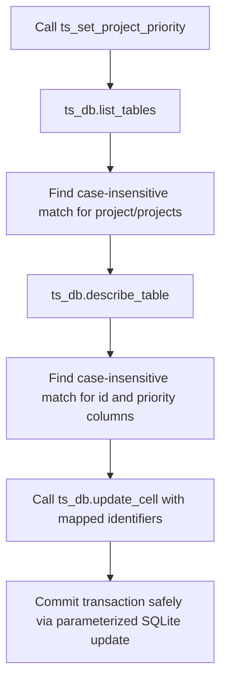

# API Design Plan: Proposed Endpoint Signatures

This document outlines the detailed API specification, proposed MCP tool signatures, and integration architecture to promote the action placeholders in [placeholders.py](file:///C:/Users/soyko/Documents/nina-mcp/src/nina_mcp/tools/placeholders.py) and expand Target Scheduler integration in [target_scheduler.py](file:///C:/Users/soyko/Documents/nina-mcp/src/nina_mcp/tools/target_scheduler.py) to fully functional tools.

---

## Global Integration and Error Architecture

### Upstream API Communication
All equipment tools communicate with NINA via the `ninaAPI` ("Advanced API") plugin using asynchronous HTTP REST requests. The communication is facilitated by the module-level client singleton defined in [nina_client.py](file:///C:/Users/soyko/Documents/nina-mcp/src/nina_mcp/nina_client.py).

Every REST API request returns a structured JSON response envelope matching:
```json
{
  "Response": <the actual payload or null>,
  "Error": "<message, empty on success>",
  "StatusCode": 200,
  "Success": true,
  "Type": "API"
}
```

### Error Wrapping: `NinaAPIError`
When NINA reports a failure (e.g., `Success: false` or the HTTP status code is not 2xx), the client raises a `NinaAPIError`. This exception encapsulates:
- The error message returned by NINA (or a generic message if empty).
- The HTTP/REST status code (defaulting to 500 if not provided).

Common error scenarios include:
1. **Device Not Connected**: Attempting to query or command a device before connecting it via `nina_connect_device` (defined in [equipment.py](file:///C:/Users/soyko/Documents/nina-mcp/src/nina_mcp/tools/equipment.py)) raises an error, e.g. `"Device is not connected."` (typically with status code `400` or `500`).
2. **Parameters Out of Bounds**: Sending a value outside physical ranges (e.g., negative positions, angles outside `[0.0, 360.0]`) results in a server-side validation error from NINA or client-side validation before sending the request.
3. **HTTP/Connection Failure**: If the NINA instance is closed, or the plugin is disabled, an HTTP request error is caught, and a `NinaAPIError` is raised with a descriptive message advising the user to check NINA and config settings (port/host).

---

## Equipment Control Specifications

### 1. Filter Wheel Control

#### `nina_filterwheel_change_filter`
* **Route**: `GET /equipment/filterwheel/change-filter`
* **Description**: Change the active filter in the filter wheel.
* **Parameters**:
  | Name | Type | Valid Values | Default | Description |
  | :--- | :--- | :--- | :--- | :--- |
  | `filter_id` | `int` | `0` to `N-1` (typically 0-indexed position) | *Required* | The index/position of the filter to change to. |

* **Validation & Error Scenarios**:
  - `ValueError` is raised if `filter_id` is negative.
  - `NinaAPIError` (500) if the filter wheel is not connected.
  - `NinaAPIError` (400/500) if `filter_id` is greater than the index of available filters.

* **Proposed Implementation**:
  ```python
  @mcp.tool()
  async def nina_filterwheel_change_filter(filter_id: int) -> dict:
      """Change the active filter in the filter wheel.
      
      filter_id: The index/position of the filter to change to (0-indexed). Must be >= 0.
      """
      if filter_id < 0:
          raise ValueError(f"filter_id must be a non-negative integer, got {filter_id}")
      return await client.get("/equipment/filterwheel/change-filter", filter=filter_id)
  ```

---

### 2. Focuser Control

#### `nina_focuser_move`
* **Route**: `GET /equipment/focuser/move`
* **Description**: Move the focuser to a specific absolute step position.
* **Parameters**:
  | Name | Type | Valid Values | Default | Description |
  | :--- | :--- | :--- | :--- | :--- |
  | `position` | `int` | `0` to `MaxSteps` (driver dependent) | *Required* | Target absolute position in steps. |

* **Validation & Error Scenarios**:
  - `ValueError` is raised if `position` is negative.
  - `NinaAPIError` (500) if the focuser is not connected.
  - `NinaAPIError` (400/500) if the target position exceeds the focuser's maximum travel limit.

* **Proposed Implementation**:
  ```python
  @mcp.tool()
  async def nina_focuser_move(position: int) -> dict:
      """Move the focuser to a specific absolute step position.
      
      position: Target absolute position in steps. Must be >= 0.
      """
      if position < 0:
          raise ValueError(f"position must be a non-negative integer, got {position}")
      return await client.get("/equipment/focuser/move", position=position)
  ```

#### `nina_focuser_stop`
* **Route**: `GET /equipment/focuser/stop-move`
* **Description**: Immediately halt any in-progress focuser travel.
* **Parameters**: None.
* **Validation & Error Scenarios**:
  - `NinaAPIError` (500) if the focuser is not connected.

* **Proposed Implementation**:
  ```python
  @mcp.tool()
  async def nina_focuser_stop() -> dict:
      """Stop any in-progress focuser movement."""
      return await client.get("/equipment/focuser/stop-move")
  ```

---

### 3. Rotator Control

#### `nina_rotator_move`
* **Route**: `GET /equipment/rotator/move`
* **Description**: Slew the rotator to a specific sky angle.
* **Parameters**:
  | Name | Type | Valid Values | Default | Description |
  | :--- | :--- | :--- | :--- | :--- |
  | `angle` | `float` | `0.0` to `360.0` | *Required* | Target sky position angle in degrees. |

* **Validation & Error Scenarios**:
  - `ValueError` is raised if `angle` is not within the range `[0.0, 360.0]`.
  - `NinaAPIError` (500) if the rotator is not connected.

* **Proposed Implementation**:
  ```python
  @mcp.tool()
  async def nina_rotator_move(angle: float) -> dict:
      """Slew the rotator to a specific sky angle.
      
      angle: Target sky position angle in degrees (0.0 to 360.0).
      """
      if not (0.0 <= angle <= 360.0):
          raise ValueError(f"angle must be between 0.0 and 360.0 degrees, got {angle}")
      return await client.get("/equipment/rotator/move", angle=angle)
  ```

#### `nina_rotator_stop`
* **Route**: `GET /equipment/rotator/stop-move`
* **Description**: Stop any in-progress rotator movement.
* **Parameters**: None.
* **Validation & Error Scenarios**:
  - `NinaAPIError` (500) if the rotator is not connected.

* **Proposed Implementation**:
  ```python
  @mcp.tool()
  async def nina_rotator_stop() -> dict:
      """Stop any in-progress rotator movement."""
      return await client.get("/equipment/rotator/stop-move")
  ```

---

### 4. Dome Control

#### `nina_dome_open`
* **Route**: `GET /equipment/dome/open`
* **Description**: Open the dome shutter.
* **Parameters**: None.
* **Validation & Error Scenarios**:
  - `NinaAPIError` (500) if the dome is not connected or if the shutter is obstructed.

* **Proposed Implementation**:
  ```python
  @mcp.tool()
  async def nina_dome_open() -> dict:
      """Open the dome shutter."""
      return await client.get("/equipment/dome/open")
  ```

#### `nina_dome_close`
* **Route**: `GET /equipment/dome/close`
* **Description**: Close the dome shutter.
* **Parameters**: None.
* **Validation & Error Scenarios**:
  - `NinaAPIError` (500) if the dome is not connected.

* **Proposed Implementation**:
  ```python
  @mcp.tool()
  async def nina_dome_close() -> dict:
      """Close the dome shutter."""
      return await client.get("/equipment/dome/close")
  ```

#### `nina_dome_slew`
* **Route**: `GET /equipment/dome/slew`
* **Description**: Slew the dome to a specific azimuth angle.
* **Parameters**:
  | Name | Type | Valid Values | Default | Description |
  | :--- | :--- | :--- | :--- | :--- |
  | `azimuth` | `float` | `0.0` to `360.0` | *Required* | Target azimuth in degrees (North is 0.0, East is 90.0). |

* **Validation & Error Scenarios**:
  - `ValueError` is raised if `azimuth` is not within `[0.0, 360.0]`.
  - `NinaAPIError` (500) if the dome is not connected or fails to slew.

* **Proposed Implementation**:
  ```python
  @mcp.tool()
  async def nina_dome_slew(azimuth: float) -> dict:
      """Slew the dome to a specific azimuth.
      
      azimuth: Target azimuth in degrees (0.0 to 360.0).
      """
      if not (0.0 <= azimuth <= 360.0):
          raise ValueError(f"azimuth must be between 0.0 and 360.0 degrees, got {azimuth}")
      return await client.get("/equipment/dome/slew", azimuth=azimuth)
  ```

---

### 5. Guider Control

#### `nina_guider_start`
* **Route**: `GET /equipment/guider/start`
* **Description**: Start the autoguider loop.
* **Parameters**:
  | Name | Type | Valid Values | Default | Description |
  | :--- | :--- | :--- | :--- | :--- |
  | `calibrate` | `bool` | `True` or `False` | `False` | Force a new calibration sequence before guiding begins. |

* **Validation & Error Scenarios**:
  - `NinaAPIError` (500) if the guider device is not connected or the guider software (e.g., PHD2) is unreachable.

* **Proposed Implementation**:
  ```python
  @mcp.tool()
  async def nina_guider_start(calibrate: bool = False) -> dict:
      """Start the autoguider.
      
      calibrate: True to force calibration, False to guide using existing calibration.
      """
      return await client.get("/equipment/guider/start", calibrate=calibrate)
  ```

#### `nina_guider_stop`
* **Route**: `GET /equipment/guider/stop`
* **Description**: Stop autoguiding.
* **Parameters**: None.
* **Validation & Error Scenarios**:
  - `NinaAPIError` (500) if the guider device is not connected or the guider software is unreachable.

* **Proposed Implementation**:
  ```python
  @mcp.tool()
  async def nina_guider_stop() -> dict:
      """Stop the autoguider."""
      return await client.get("/equipment/guider/stop")
  ```

---

### 6. Switch Control

#### `nina_switch_set`
* **Route**: `GET /equipment/switch/set`
* **Description**: Set a switch value (e.g., toggling a relay or adjusting a dimmable power port).
* **Parameters**:
  | Name | Type | Valid Values | Default | Description |
  | :--- | :--- | :--- | :--- | :--- |
  | `switch_index` | `int` | `0` to `N-1` | *Required* | The index of the switch to set. |
  | `value` | `float` | Depending on the switch type (typically `0.0` or `1.0` for relays; intermediate values for sliders) | *Required* | The target state or value. |

* **Validation & Error Scenarios**:
  - `ValueError` is raised if `switch_index` is negative.
  - `NinaAPIError` (500) if the switch device is not connected.
  - `NinaAPIError` (400/500) if the value is out of bounds for the designated switch index.

* **Proposed Implementation**:
  ```python
  @mcp.tool()
  async def nina_switch_set(switch_index: int, value: float) -> dict:
      """Set a switch value (e.g. relay state or slider value).
      
      switch_index: Index of the switch. Must be >= 0.
      value: Target state (0.0 for OFF, 1.0 for ON, or intermediate value for sliders).
      """
      if switch_index < 0:
          raise ValueError(f"switch_index must be a non-negative integer, got {switch_index}")
      return await client.get("/equipment/switch/set", index=switch_index, value=value)
  ```

---

### 7. Flat Device Control

#### `nina_flatdevice_set_light`
* **Route**: `GET /equipment/flatdevice/set-light`
* **Description**: Turn the flat panel illumination light source on or off.
* **Parameters**:
  | Name | Type | Valid Values | Default | Description |
  | :--- | :--- | :--- | :--- | :--- |
  | `on` | `bool` | `True` or `False` | *Required* | `True` to turn the light ON, `False` to turn it OFF. |

* **Validation & Error Scenarios**:
  - `NinaAPIError` (500) if the flat panel device is not connected.

* **Proposed Implementation**:
  ```python
  @mcp.tool()
  async def nina_flatdevice_set_light(on: bool) -> dict:
      """Turn the flat panel light on or off.
      
      on: True to turn light ON, False to turn light OFF.
      """
      return await client.get("/equipment/flatdevice/set-light", power=on)
  ```

---

## Target Scheduler Typed Write Operations

### Database Access & Safety Architecture
Because Target Scheduler does not expose REST APIs for editing database values, the MCP server must interact directly with its local SQLite database via [ts_db.py](file:///C:/Users/soyko/Documents/nina-mcp/src/nina_mcp/ts_db.py). 

> [!IMPORTANT]
> Writing to the database is disabled by default for safety. All write operations will verify that `TS_ALLOW_WRITES` is set to `true` in the environment configuration, raising a `TargetSchedulerDBError` otherwise.

### Dynamic Schema Discovery for TS4 & TS5
Target Scheduler databases undergo table and column name migrations depending on whether they run version 4 or version 5. For instance, the main target table could be named `Target` or `Targets`, and status columns might be `Active`, `Enabled`, or `RunState`. 

To prevent SQL execution errors or database corruption, the typed tools implement a **dynamic schema discovery** protocol:
1. **Table Casing/Pluralization Mapping**: Use `ts_db.list_tables()` to fetch all active tables and select the match matching `project` or `target` case-insensitively.
2. **Column Metadata Verification**: Execute `ts_db.describe_table(table_name)` to query current columns. We look for case-insensitive column names (e.g. matching `id`, `priority`, or state fields like `active`/`enabled`/`runstate`).
3. **Targeted Parameterized Update**: Feed verified names into `ts_db.update_cell` which guarantees safety by using parameterized query binds.



---

### `ts_set_project_priority`
* **Description**: Set the scheduling priority for a specific project in the database.
* **Parameters**:
  | Name | Type | Valid Values | Default | Description |
  | :--- | :--- | :--- | :--- | :--- |
  | `project_id` | `int` | Existing project ID in the database | *Required* | The primary key identifier of the project. |
  | `priority` | `int` | Integer values (typically 1 = Highest) | *Required* | The priority value to assign. |

* **Validation & Error Scenarios**:
  - Raises `TargetSchedulerDBError` if `TS_ALLOW_WRITES` is false.
  - Raises `ValueError` if the project table or ID/Priority columns cannot be discovered.
  - Returns `rows_affected: 0` if `project_id` does not exist in the database.

* **Proposed Implementation**:
  ```python
  @mcp.tool()
  async def ts_set_project_priority(project_id: int, priority: int) -> dict:
      """Set the scheduling priority for a specific project.
      
      project_id: The unique ID of the project.
      priority: Target priority integer. Lower values represent higher priority (e.g., 1 is highest).
      """
      # 1. Discover the correct project table name (case-insensitive search)
      tables = ts_db.list_tables()
      project_table = None
      for t in tables:
          if t.lower() in ("project", "projects"):
              project_table = t
              break
      if not project_table:
          raise ValueError(
              "Could not find a project table (expected 'Project' or 'Projects') "
              "in the Target Scheduler database."
          )
  
      # 2. Inspect columns to find exact casing for ID and Priority columns
      columns = ts_db.describe_table(project_table)
      id_column = None
      priority_column = None
      for col in columns:
          name_lower = col["name"].lower()
          if name_lower == "id":
              id_column = col["name"]
          elif name_lower == "priority":
              priority_column = col["name"]
  
      if not id_column:
          raise ValueError(f"Could not find an ID column in the '{project_table}' table.")
      if not priority_column:
          raise ValueError(f"Could not find a Priority column in the '{project_table}' table.")
  
      # 3. Perform the update
      rows_affected = ts_db.update_cell(
          table=project_table,
          id_column=id_column,
          id_value=project_id,
          column=priority_column,
          value=priority,
      )
      return {
          "status": "success",
          "table": project_table,
          "id_column": id_column,
          "priority_column": priority_column,
          "rows_affected": rows_affected,
      }
  ```

---

### `ts_toggle_target_enabled`
* **Description**: Enable or disable a target (changing its scheduling activity status).
* **Parameters**:
  | Name | Type | Valid Values | Default | Description |
  | :--- | :--- | :--- | :--- | :--- |
  | `target_id` | `int` | Existing target ID in the database | *Required* | The primary key identifier of the target. |
  | `enabled` | `bool` | `True` or `False` | *Required* | State to change the target to. |

* **Validation & Error Scenarios**:
  - Raises `TargetSchedulerDBError` if `TS_ALLOW_WRITES` is false.
  - Raises `ValueError` if the target table or ID/Active columns cannot be discovered.
  - Returns `rows_affected: 0` if `target_id` does not exist.

* **Proposed Implementation**:
  ```python
  @mcp.tool()
  async def ts_toggle_target_enabled(target_id: int, enabled: bool) -> dict:
      """Toggle the enabled/active state of a specific target.
      
      target_id: The unique ID of the target.
      enabled: True to enable/activate the target, False to disable.
      """
      # 1. Discover the correct target table name (case-insensitive search)
      tables = ts_db.list_tables()
      target_table = None
      for t in tables:
          if t.lower() in ("target", "targets"):
              target_table = t
              break
      if not target_table:
          raise ValueError(
              "Could not find a target table (expected 'Target' or 'Targets') "
              "in the Target Scheduler database."
          )
  
      # 2. Inspect columns to find exact casing for ID and Active/Enabled/RunState columns
      columns = ts_db.describe_table(target_table)
      id_column = None
      enabled_column = None
      
      # Common column names representing target activation state
      state_candidates = {"active", "enabled", "runstate"}
      
      for col in columns:
          name_lower = col["name"].lower()
          if name_lower == "id":
              id_column = col["name"]
          elif name_lower in state_candidates:
              # Prefer 'active' if available, otherwise fallback to whichever matches
              if not enabled_column or name_lower == "active":
                  enabled_column = col["name"]
  
      if not id_column:
          raise ValueError(f"Could not find an ID column in the '{target_table}' table.")
      if not enabled_column:
          raise ValueError(
              f"Could not find an activation status column (e.g. 'Active', 'Enabled', "
              f"or 'RunState') in the '{target_table}' table."
          )
  
      # 3. Perform the update (using 1 for active/enabled, 0 for inactive/disabled)
      val = 1 if enabled else 0
      rows_affected = ts_db.update_cell(
          table=target_table,
          id_column=id_column,
          id_value=target_id,
          column=enabled_column,
          value=val,
      )
      return {
          "status": "success",
          "table": target_table,
          "id_column": id_column,
          "enabled_column": enabled_column,
          "rows_affected": rows_affected,
      }
  ```
